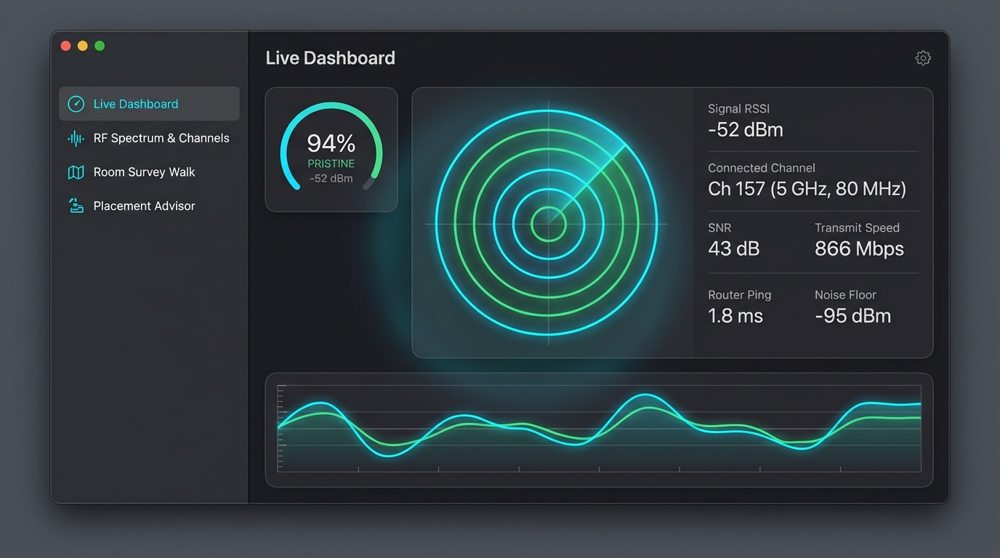

# WiFi Signal 📶

> A native macOS SwiftUI application designed to analyze Wi-Fi signal strength in real time, inspect the active channel, detect radio interference and channel congestion, and guide optimal router placement.



---

## ✨ Features

### 1. 2D Real-Time Dashboard
* **Dynamic Waveform & Radar Visualizer**: 60fps pulsating concentric radar canvas with a rotating sweep beam, color-shifting from Emerald Green (pristine) to Crimson (dead zone).
* **Radial Signal Gauge**: High-precision 0–100% Signal Quality Index (SQI) fusing physical RF metrics with link-layer telemetry.
* **Live Oscilloscope History**: Scrolling timeline plotting live RSSI (dBm), Noise Floor (dBm), and Gateway Latency (ms) over a sliding 60-second window as you walk around with your MacBook.
* **6-Metric Telemetry HUD**:
  * **Signal Strength**: Raw `RSSI` in dBm (e.g. `-52 dBm`)
  * **Connected Channel**: Active channel (e.g. `Ch 157`), band (`5 GHz`), and channel width (`80 MHz`)
  * **Noise Floor & SNR**: Measures background RF noise (`-95 dBm`) and computes true `SNR` (`43 dB`)
  * **Transmit Link Speed**: Negotiated PHY speed in Mbps (e.g. `866 Mbps`)
  * **Router Ping Latency & Jitter**: Direct latency and RFC-3550 jitter to your default gateway (`192.168.1.1`)
  * **Packet Loss Rate**: Sliding window loss rate with retransmission alerts

### 2. RF Spectrum & Channel Interference Analyzer
* **Visual Spectrum Bar Chart**: Compares your connected channel against neighboring networks.
* **Co-Channel Interference (CCI) Detection**: Identifies how many neighboring routers share your frequency.
* **Channel Recommendation Engine**: Automatically calculates the cleanest, least congested channels for 2.4 GHz (1, 6, 11) and 5 GHz bands.
* **Access Point Inventory**: Displays SSID, BSSID, RSSI, and channel details for all detected access points.

### 3. Room-by-Room Walkthrough & Survey
* **Walk & Map Mode**: Walk to different rooms (Living Room, Office, Bedroom, Kitchen, Basement) and log signal checkpoints with one click.
* **Signal Grading**: Assigns letter grades (`A+` to `F`) and coverage verdicts.
* **Placement Audit Summary**: Compares strongest vs. weakest areas to pinpoint coverage drop-off and recommend router repositioning.

### 4. Router Placement & Optimization Advisor
* **Active Diagnostics**: Real-time evaluation of wall attenuation, RF noise, and airtime saturation.
* **Golden Rules of Router Placement**: Actionable rules on router elevation, antenna orientation, avoiding concrete/appliances, and mitigating Bluetooth/USB 3.0 interference.

---

## 🛠 Project Structure

```
WiFiSignal/
├── project.yml                     # XcodeGen project specification
├── WiFiSignal.xcodeproj            # Generated Xcode project
├── LICENSE                         # Apache 2.0 License
├── docs/
│   └── screenshot.png              # Application screenshot
├── Resources/
│   ├── Info.plist                  # Location & network permissions
│   └── WiFiSignal.entitlements      # CoreWLAN & networking entitlements
└── Sources/
    ├── App/
    │   └── WiFiSignalApp.swift      # Main SwiftUI entry point
    ├── Models/
    │   ├── WiFiMetrics.swift        # CoreWLAN telemetry & SQI calculation
    │   ├── ScannedNetwork.swift     # Neighbor network & channel utilization
    │   ├── RoomSurvey.swift         # Walkthrough survey points & grades
    │   └── OptimizationAdvice.swift # Diagnostic recommendations
    ├── Services/
    │   ├── WiFiMonitor.swift        # Master telemetry coordinator
    │   ├── GatewayProber.swift      # Ping latency, jitter & packet loss
    │   ├── NetworkScanner.swift     # Background RF access point scanner
    │   ├── OptimizationEngine.swift # Rule-based diagnostic engine
    │   └── LocationPermissionHelper.swift # CoreLocation manager
    ├── Components/
    │   ├── SignalRadarCanvas.swift  # 60fps Canvas radar animation
    │   ├── RadialGaugeView.swift    # Circular gauge dial
    │   ├── LiveHistoryGraph.swift   # Oscilloscope timeline graph
    │   ├── MetricCard.swift         # Glassmorphic telemetry tiles
    │   └── SpectrumBarChart.swift   # 2.4/5GHz spectrum visualizer
    └── Views/
        ├── MainView.swift           # Sidebar navigation
        ├── DashboardView.swift      # Live telemetry dashboard
        ├── ChannelSpectrumView.swift# Spectrum analyzer & recommendations
        ├── RoomSurveyView.swift     # Room walk & placement audit
        └── OptimizationAdvisorView.swift # Router placement guide
```

---

## 🚀 Building & Running

### Option 1: Open in Xcode
1. Open the project in Xcode:
   ```bash
   open WiFiSignal.xcodeproj
   ```
2. Select the `WiFiSignal` scheme and press **Cmd + R** to run.

### Option 2: Regenerate with XcodeGen
If you modify `project.yml`, regenerate the project anytime:
```bash
xcodegen generate
```

### Option 3: Command Line Build
```bash
xcodebuild -project WiFiSignal.xcodeproj -scheme WiFiSignal -derivedDataPath ./DerivedData build
```
Launch the compiled app:
```bash
open DerivedData/Build/Products/Debug/WiFiSignal.app
```

---

## 📄 License

Licensed under the Apache License, Version 2.0 (the "License");
you may not use this file except in compliance with the License.
You may obtain a copy of the License at

    http://www.apache.org/licenses/LICENSE-2.0

Unless required by applicable law or agreed to in writing, software
distributed under the License is distributed on an "AS IS" BASIS,
WITHOUT WARRANTIES OR CONDITIONS OF ANY KIND, either express or implied.
See the License for the specific language governing permissions and
limitations under the License.
